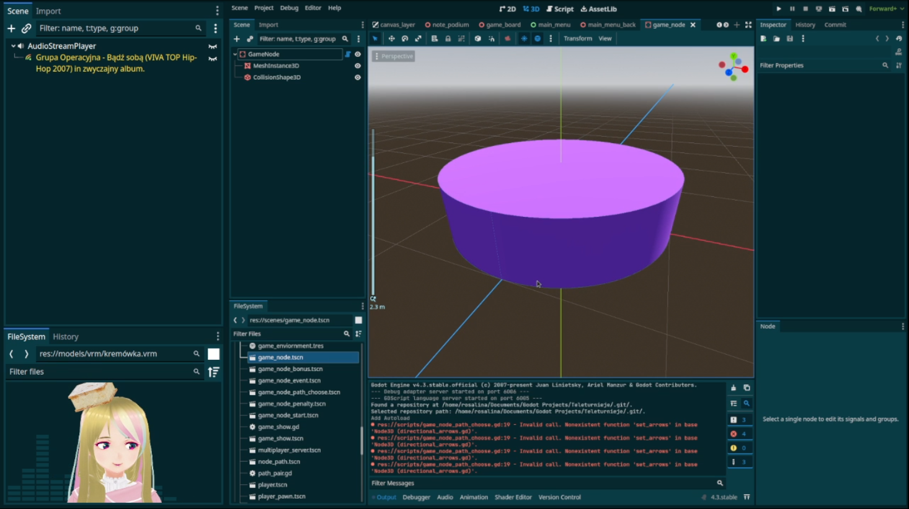
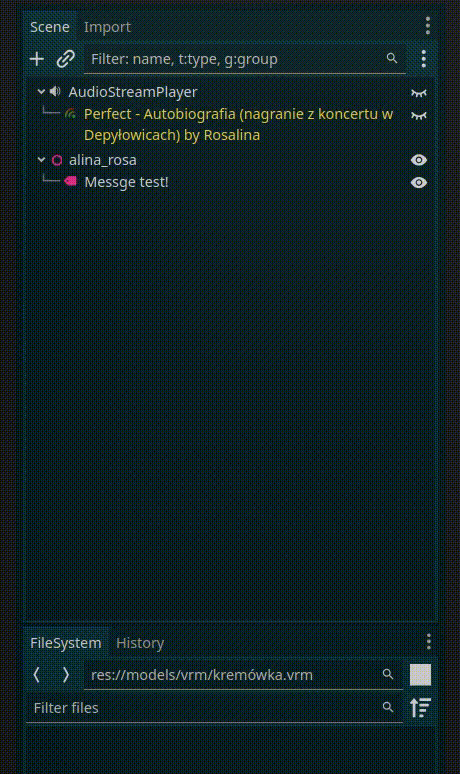
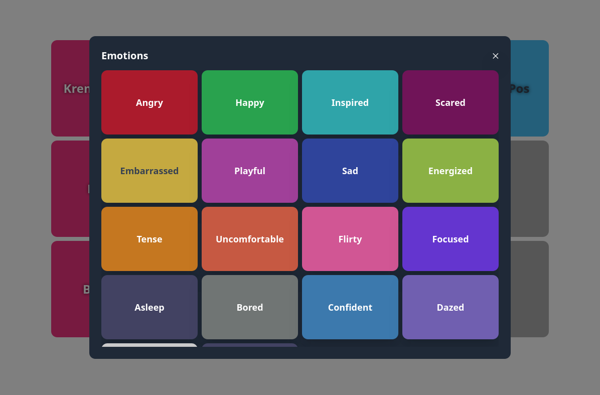
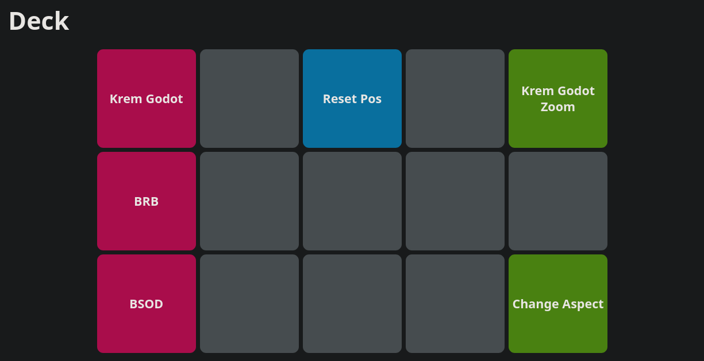

# Krem Overlays
Overlays I use on my stream and server running them. It's websockets galore.

NOTE: If you're not tech savvy feel free to open an issue. This project kinda assumes you are,
but if you're here just for cool overlays that's cool too and I'm here to help :)



## Deps

* `bun`
  * and whatever `bun i` will install


## Short intro
This is basically a webapp + server. Overlays are written in React + Vite (+ Tailwind etc.).
Backend is Bun, for fun. Hardcoded to fit 1080p specifically.

This does not include things like music visualizer, or VNyan camera feed, or screen capture. These are done in OBS.
This is basically for chat, follows, some stream controls and style.

## How to use
Fill in .env with:
```
BACKEND_URL="http://localhost:3000"               # for vite I think?
TWITCH_CLIENT_ID=<your client id here>            # for twitch api
TWITCH_CLIENT_SECRET=<your client secret here>    # same as above
TWITCH_USER_TOKEN=<your twitch user token here>   # only needed for follows
OBS_WS_PASSWORD=<your obs password here>          # for obs if you want to switch scenes or etc.
```
Then
```bash
bun i
```
```bash
bun server
```

- In the `/` page press "Init modules" to start all server integrations (OBS, Twitch, VNyan).
- Open any overlay in 1920x1080 (like OBS browser source)
- Open Deck if you wish

Check package.json for exact commands undeneath. Basically bunx with vite.

## Features
### Overlays
#### Godot
```
/look/godot
```


Overlay mimicking the look of Godot's sidebar. Chats and follows come in like Nodes in the tree,
and music is bound to the AudioStreamPlayer at the top. Chats fetch user's twitch chat color (nice).

You can turn off or on the bottom panel (now used for Mario Kart 8 stats and [ravarcheon's string lerp](https://bsky.app/profile/ravarcheon.com/post/3lav6cp7njk2d))
via the `wide` state. It's set up in a way that without it free space is 4:3, with it 16:9.

This uses the Solarized Dark as a theme, as that's what I use. I tried to stick just to Tailwind classes,
so it may be a bit of manual work to tweak the colors, but it's doable.
If you'd like a theme support or something, feel free to open a PR. Or an issue at least.

#### The Sims
```
/look/sims
```
**🏗️ Under construction**
The following is a sort of specification, a roadmap if you will.

A collection of 4 distinct in style, yet similar in layout overlays, each inspired by a main Sims game.

Modals are prolly with pictures like in games.

**The Sims**

🏗️ Under construction

- Cam
  - Dunno yet
- Chats
  - Notifications on side
- Follows
  - big modal with "OK"

**The Sims 2**

🏗️ Under construction

- Cam
  - Dunno yet
- Chats
  - Notifications on side
- Follows
  - smaller modal with "OK"

**The Sims 3**

🏗️ Under construction

- Cam
  - Dunno yet
- Chats
  - Notifications on side
- Follows
  - big modal with "OK"

**The Sims 4**


🏗️ Under construction:
- poc changing emotions based on blendshapes in VNyan

Music scrolls if text overflows.

New followers pop-up like phone calls.

Emotions can be changed from Deck and should have game accurate colors.
Some redundant are missing on purpose, but can be easily added.


- Cam
  - UI from game with customizable emotions
- Chats
  - Notifications on side
- Follows
  - Dunno, maybe calls?

### Stream Deck
```
/look/deck
```


I don't have cash to spend on a Stream Deck, so I build one in here. It communicates via websockets
with the server and overlays to change a scene, reset avatar position or toggle something in the overlay.

You can also open a modal containing more buttons (see Mario Kart implementation).

Instead of colors you may also use an image. Just put it in `frontend/src/assets/images` and import it. Text will align
automagically on buttons with images.

### Integrations

#### VNyan
Websocket communication. For now only sending "Reset Pos" to VNyan.

Make sure you have websockets enabled in VNyan and a node graph capturing a message. Here I just pass
the description of the Deck button as the message.

#### Twitch
**Overview**

Done 2 ways: `node-twitch` and `tmi.js`. Second one gets chats, no auth needed. First one gets users colors
and new follows. For colors you just need basic Twitch app with secret and id. For follows you need a User Access Token, for which I haven't built in a seamless integration (I just
generate mine in a separate app and dont even refresh it lol). May do this someday. If you know how,
or think it'd be just neat, open an issue or a PR.

Colors when first fetched are stored in `.color-cache.json` (will be created if not present) for 30 days. This is as to not call Twitch api any time
someone sends a message. Timeout is configurable. You could keep them forever I guess, but you won't notice when someone changes their color.

Same is done for profile picture URLs in `.profile.cache.json`. Note it's URLs only, not actual images.

**🏗️ Under construction**
Caching of user profile pictures. This will be needed for Sims overlays.

**Authentication**

I check for an access token in `.token` (don't confuse with User Access Token). If it's not there
we generate a new one and store it there. Same if it's invalid (like expired for example).

For follows you need a User Access Token with `moderator:read:followers` scope. I generate mine with this project: https://github.com/twitchdev/authentication-node-sample/tree/main.
I don't refresh it in any way, so currently it's the only manual part of this setup. I plan on including
it in the initial setup of the server (as I already see some refactoring potential).


#### OBS
For now `obs-websocket-js` has problems under Bun (see https://github.com/oven-sh/bun/issues/10459).
My workaround? Previous one you'll see in history, was to run separate Node.js server as a kind of proxy.
Now it's nicely written kinda from scratch. Ofc some copypasted code, but hey, it works. As much as I
hate generative AI, gotta hand it to Claude, it works. I assume it's based off snippets I wasn't able to find
over the internet, or actual implementation of the not-so-working lib. Whatever, if there's a bug in it
I'll have no clue how to fix it lol.

#### Music
Music assumes you have `playerctl` on your system and are palying music from something that plays nicely
with MPRIS (so, like, basically anything). If you're a Windows dweller... Shoot up an issue and I'll try
to get it done. Or better yet, a PR ;)
